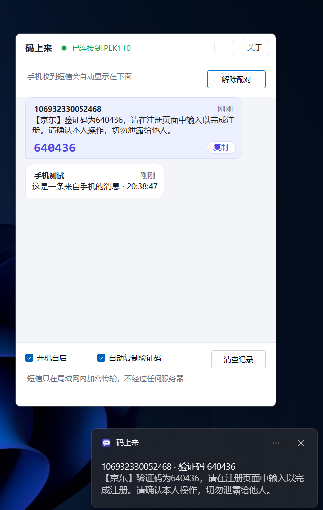
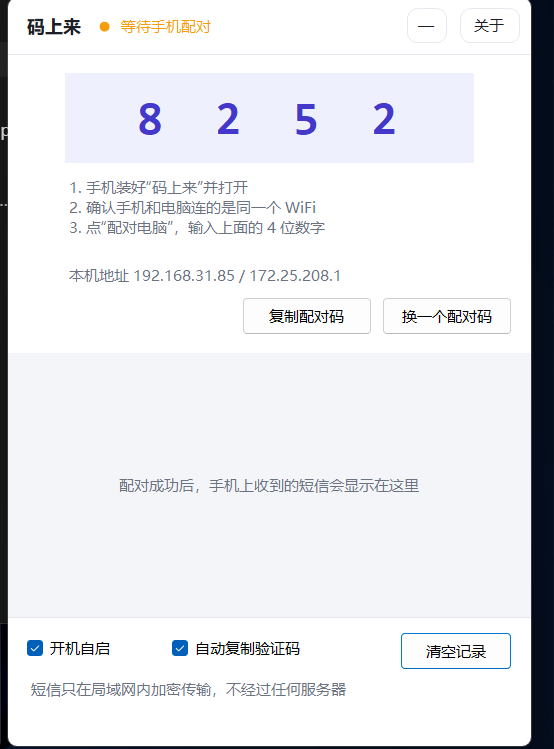
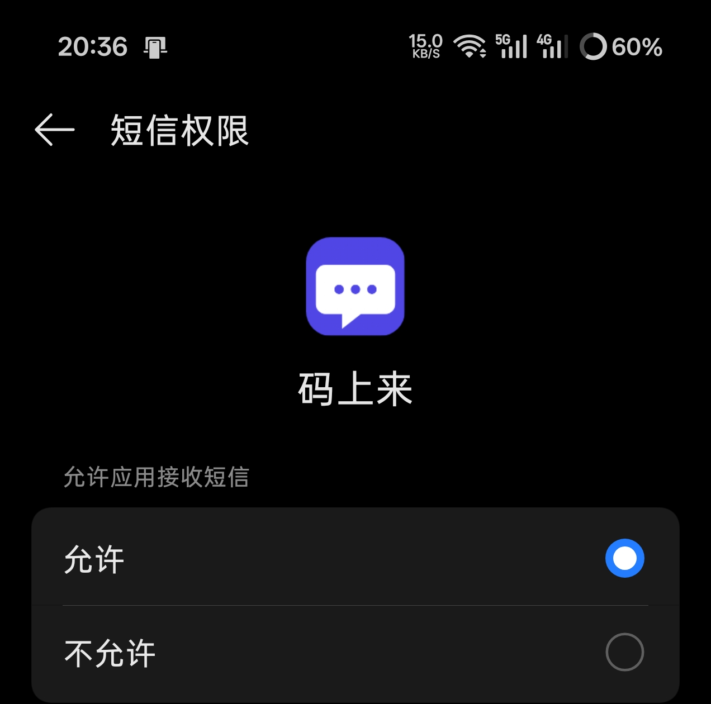
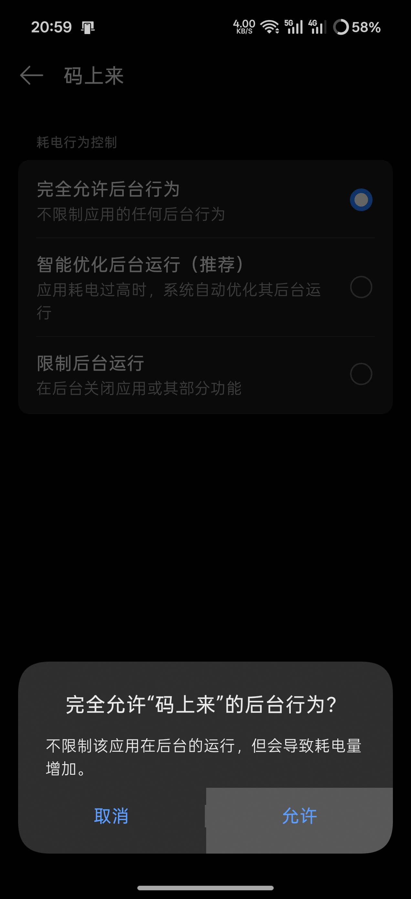
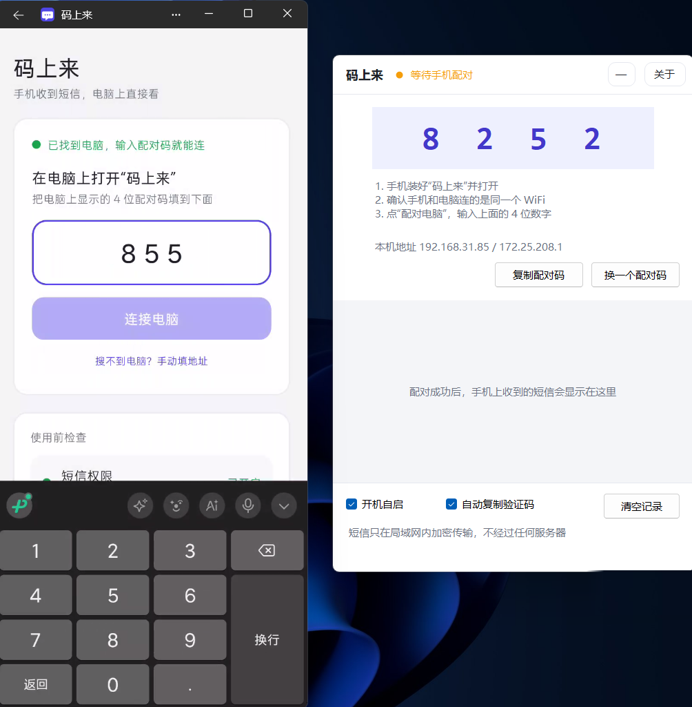

# 码上来

**手机收到的短信和验证码，无需拿出手机将会立刻出现在电脑上。**

局域网直连 · AES-256-GCM 加密 · 不经过任何服务器 · 不收集任何数据 · 免费

仓库地址：<https://github.com/DingYaoYao/sms-to-pc> ｜ 邮箱：dog8520963@163.com



---

## 它解决什么问题

登录网银、注册账号、改密码……验证码发到手机上，人却坐在电脑前。解锁手机、切到短信、记住那 6 个数字、再回到电脑——每次都这样。

**码上来**在你自己的手机和电脑之间搭一条加密的局域网通道：手机收到的每一条短信，立刻出现在电脑窗口里实现不用看手机即可接受验证码；**验证码会自动高亮、自动复制到剪贴板**，你直接 Ctrl+V 就行。

没有账号，没有服务器，没有广告。手机和电脑连同一个 WiFi 就能用。

---

## 特性

| 功能 | 说明 |
| --- | --- |
| 免安装 | 电脑端是单个 exe（自带运行时），双击就跑；手机端一个 APK |
| 4 位配对码 | 电脑上显示 4 位数字，手机上输一次，之后自动连接 |
| 验证码自动复制 | 识别到验证码直接进剪贴板，也可以点通知一键复制 |
| 聊天气泡列表 | 短信按时间倒序，带验证码的那条高亮显示，点一下就能复制 |
| 关窗后台运行 | 电脑端右上只有"最小化"和"关于"，退出走托盘菜单，不占任务栏 |
| 开机自启 | 勾一下即可（写当前用户的启动项，不需要管理员权限） |
| 贴边不打扰 | 无边框小窗，默认停在屏幕右下角，可以随手拖到别处 |

---

## 下载

| 平台 | 文件 | 说明 |
| --- | --- | --- |
| Windows 10/11 (x64) | `mashanglai-v1.5-windows-x64.exe` | 在 [Releases](../../releases) 里下载，双击即用（免安装，自带运行时） |
| Android 8.0+ | [`dist/码上来-1.5.apk`](dist/码上来-1.5.apk) | 在 [Releases](../../releases) 里下载 `mashanglai-v1.5-android.apk` 也行 |

> Release 里的文件名用英文（`mashanglai-...`），是为了避免部分系统下载中文名时乱码；仓库里的源码文件名仍保留中文。

> Windows 端首次运行如果弹出防火墙提示，请勾选"专用网络"并允许——不然后面手机搜不到电脑。

**国内下载（蓝奏云）**：<https://wwbjs.lanzoue.com/b0mcu44gj>　密码：`2dq1`

> GitHub 打不开或者下载慢的话，用上面这个链接。两边内容一样。

---

## 使用教程

### 第一步：电脑端

双击 `码上来.exe`，窗口会出现在屏幕右下角，上半部分是一个 **4 位配对码**（比如 `8252`），旁边写着本机地址。



### 第二步：手机端

1. 把 `码上来-1.5.apk` 传到手机，点击安装（首次需要在系统里允许"安装未知来源应用"）。
2. 打开 App，它会依次请你开两个权限，**都点允许**：
   - **短信权限** —— 不给自己收不到任何短信
   - **后台运行** —— 忽略电池优化，不然锁屏后系统会限制它（部分小米/华为等机型还会让你去开"自启动"，可以直接跳过去）




3. 页面会自动搜索同一 WiFi 下的电脑，搜到之后**直接输入电脑上那 4 位数字**，输满自动连接。



> 手机和电脑必须在同一个局域网（同一个路由器的 WiFi；电脑插网线、手机连同一路由器的 WiFi 也算）。不需要联网，数据不出路由器。

### 第三步：开始用

配对成功后不用再管它。以后手机每收到一条短信，电脑窗口里立刻弹出对应的气泡：

- **带验证码的**会高亮显示，并且自动进了你的剪贴板，直接 Ctrl+V
- 电脑右下角会同时弹出系统通知，**点一下通知会打开窗口并复制那条的验证码**
- 点气泡里的"复制"或点整条气泡也能再复制一次

### 电脑端界面

| 位置 | 作用 |
| --- | --- |
| 顶部 | 标题、连接状态、`关于` 按钮、`最小化` 按钮（**没有关闭按钮**，退出请用托盘图标右键 → 退出） |
| 中间 | 收到的短信（气泡列表，越新越靠上） |
| 底部 | `开机自启`、`自动复制验证码`、`清空记录` |
| 托盘图标 | 双击 = 把窗口叫回来；右键 = 显示窗口 / 复制配对码 / 退出 |

### 手机端界面

- 主页面只做三件事：显示连接状态、显示记录条数、检查权限（绿色=已开启，橙色=去开启）
- 底部 `关于` 进入独立页面：版本号、开发者、微信赞赏码、使用声明

### 常见设置

- **不想开机启动**：取消勾选底部"开机自启"即可（会同步删掉启动项）
- **不想自动复制**：取消勾选"自动复制验证码"，改成手动点气泡复制
- **换一台电脑**：新电脑上重新配对一次，手机端不用改任何设置
- **换一个配对码**：电脑端配对页点"换一个配对码"，手机上重新输一次

---

## 常见问题

**手机搜不到电脑？**
确认两部设备在同一个 WiFi（手机别开热点/VPN/APN 隔离）；确认 Windows 防火墙允许了它（首次运行会弹提示）；或者用手机上的"搜不到电脑？手动填地址"，输入电脑界面显示的 IP。

**显示"已配对"但收不到短信？**
检查主页面"短信权限"那一项是不是绿色。部分国产 ROM 还需要在「设置 → 应用 → 码上来」里允许自启动/后台运行。

**锁屏之后还会收到吗？**
会。它用的是系统级的短信广播，不需要 App 常驻后台。但要保证：① 短信权限已给；② 电池优化已忽略。个别系统在锁屏后会断开 WiFi，那样短信会先存在手机里，等网络恢复自动补发，电脑上只是晚一点出现。

**为什么不走蓝牙？**
车机那套读短信走的是蓝牙 MAP 协议，属于系统级能力，第三方基本复刻不了（尤其 iPhone 完全不给）。而局域网方案更快、更省电，还能全程加密。

**iPhone 能用吗？**
不能。iOS 不向第三方开放短信内容，任何声称能做到的 App 都是假的。

**支持 5G 消息 / RCS / iMessage 吗？**
不支持，只处理普通短信（SMS）。

---

## 安全说明

- **不联网**：电脑端只监听局域网，手机也只连电脑的 IP，全程没有第三方服务器参与，也不会上传任何数据。
- **正文全程加密**：短信内容用 **AES-256-GCM** 加密后传输，同时保证机密性和完整性；被篡改的报文直接丢弃。
- **配对码不等于密钥**：配对时传的是 `HMAC(PBKDF2(配对码))`（20 万次迭代），配对成功后两边换成一串随机 32 字节长密钥，之后不再使用配对码。
- **防猜防重放**：连续 5 次输错配对码锁定 60 秒；配对报文带时间戳和随机数，重复报文会被拒绝。
- **数据只在你自己的设备上**：电脑端的记录保存在程序目录的 `data/` 文件夹里，手机端保存在应用私有目录，随时可以一键清空。

> 提醒一句：验证码等于你的第二把钥匙。这套工具适合"手机在自己身上、想在大屏幕上更快更方便地复制"，**不要把转发结果再同步到群聊或云端**，那等于把双重验证降级成单重。

---

## 工作原理

```
手机(码上来 APK)  ──局域网加密──>  电脑(码上来.exe)  ──自动复制──>  剪贴板
      │                                     │
      └─ 系统短信广播 ─> 队列 ─> 加密        └─ 解密 ─> 去重 ─> 识别验证码 ─> 显示
```

| 环节 | 做法 |
| --- | --- |
| 找电脑 | 手机向局域网广播一个 UDP 包，电脑回自己的信息；也可以用 IP 手动指定 |
| 配对 | PBKDF2-HMAC-SHA256（20 万次迭代）派生密钥 + HMAC 证明，电脑验证后回发随机长密钥 |
| 传短信 | AES-256-GCM 加密后 POST 到电脑的 8789 端口 |
| 兜底 | 电脑没开机时短信留在手机队列里，下次有新短信或每隔 15 分钟自动补发 |

---

## 项目结构

```
android/                手机端（Kotlin，零第三方依赖）
  app/src/main/java/com/smslink/
    MainActivity.kt     单页主界面：配对、状态、权限
    AboutActivity.kt    关于页面
    Pairing.kt          配对流程
    Crypto.kt           PBKDF2 / HMAC / AES-GCM（与电脑端一致）
    Net.kt              局域网发现 + HTTP
    SmsReceiver.kt      系统短信广播接收
    Uploader.kt         加密上报 + 失败重试队列
    Prefs.kt            本地配置
  app/src/main/res/     布局与资源

win/                    电脑端（C# / .NET 8 WinForms，零第三方依赖）
  MainForm.cs           主窗口：气泡列表、配对、设置
  AboutForm.cs          关于窗口
  Protocol/
    Server.cs           极简 HTTP 服务（只开放 3 个接口）
    Discovery.cs        局域网发现
    Crypto.cs           与手机端一致的加密实现
    CodeExtractor.cs    验证码识别
    Store.cs            配置与存档
  Ui/                   自绘控件与配色
  make-icon.ps1         图标生成脚本

dist/                   编译好的安装包
docs/                   赞赏码等素材
```

---

## 自己编译

### 电脑端（需要 .NET 8 SDK）

```bash
cd win
dotnet publish -c Release -r win-x64 --self-contained true \
  -p:PublishSingleFile=true -p:EnableCompressionInSingleFile=true \
  -p:IncludeNativeLibrariesForSelfExtract=true
```

产物是单个 `码上来.exe`（约 64 MB，自带运行时）。

### 手机端（需要 JDK 17 + Android SDK 34）

```bash
cd android
gradlew.bat assembleRelease      # macOS / Linux 用 ./gradlew
```

产物在 `app/build/outputs/apk/release/app-release.apk`。签名信息放在 `android/keystore.properties`（已在 .gitignore 里，不会进仓库）。

---

## 支持作者

如果这个小工具帮到了你，可以扫码请我喝杯咖啡 ☕

<p align="center">
  
</p>

<p align="center">开发者：Otemain ｜ 邮箱：dog8520963@163.com</p>

---

## 免责声明

本软件只用于接收**本人手机**的短信。请勿用于监控他人设备，此类行为可能违反法律，后果自负。软件按"现状"提供，不对使用造成的任何损失承担责任。
